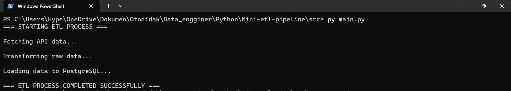
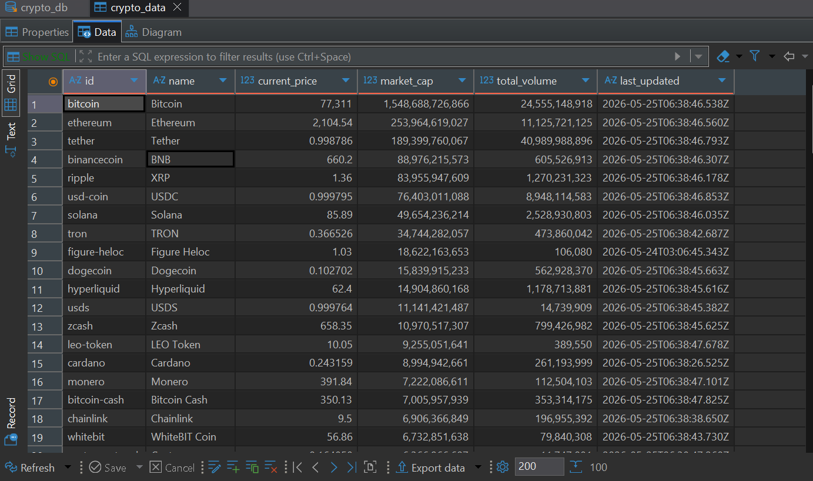

# 🚀 Mini ETL Pipeline with Python & PostgreSQL

A simple modular ETL (Extract, Transform, Load) pipeline project built using Python, Pandas, and PostgreSQL.

This project extracts cryptocurrency market data from the CoinGecko API, transforms and cleans the data using Pandas, then loads the processed data into a PostgreSQL database.

---

# 📌 Features

- Extract real-time cryptocurrency market data from CoinGecko API
- Save raw JSON data automatically
- Transform and clean data using Pandas
- Load processed data into PostgreSQL
- Modular ETL architecture
- Retry mechanism for failed processes
- Logging system for ETL status
- Environment variable security with `.env`

---

# 🛠️ Tech Stack

- Python
- Pandas
- PostgreSQL
- SQLAlchemy
- Requests
- Dotenv

---

# 📂 Project Structure

```bash
MINI-ETL-PIPELINE/
│
├── data/
│   └── raw_crypto_*.json
│
├── images/
│   ├── etl-process.png
│   └── database-result.png
│
├── logs/
│   └── logs_ETL.txt
│
├── src/
│   ├── extract.py
│   ├── transform.py
│   ├── load.py
│   └── main.py
│
├── .env
├── .gitignore
├── requirements.txt
├── LICENSE
└── README.md
```

---

# ⚙️ ETL Workflow

```text
Extract
   ↓
Transform
   ↓
Load
```

### 1. Extract
- Fetch cryptocurrency data from CoinGecko API
- Save raw JSON data into `/data`
- Retry request up to 3 times if failed
- Create ETL logs

### 2. Transform
- Convert raw JSON into Pandas DataFrame
- Select important columns:
  - id
  - name
  - current_price
  - market_cap
  - total_volume
  - last_updated

### 3. Load
- Connect to PostgreSQL database
- Load transformed data into `crypto_data` table
- Retry database loading up to 3 times if failed
- Create ETL logs

---

# 🔐 Environment Variables

Create a `.env` file in the root directory:

```env
DB_USER=your_postgresql_username
DB_PASSWORD=your_postgresql_password
```

---

# ▶️ How To Run

### 1. Install dependencies

```bash
pip install -r requirements.txt
```

### 2. Run the ETL pipeline

```bash
cd src
python main.py
```

---

# 📝 Example Logs

```text
25/05/2026, 14:20:01 EXTRACT SUCCESSFULLY
25/05/2026, 14:20:03 TRANSFORM SUCCESSFULLY
25/05/2026, 14:20:05 LOAD SUCCESSFULLY
```

---

# 🗄️ Database Output

Processed data will be stored inside PostgreSQL table:

```text
crypto_data
```

---

# 📸 Project Screenshots

## ETL Process


## PostgreSQL Database Result


---

# 🚧 Future Improvements

- Add Docker support
- Add Airflow orchestration
- Add structured logging
- Add unit testing
- Add data validation
- Add incremental loading
- Deploy pipeline to cloud environment

---

# 📖 Learning Goals

This project was built to practice:

- Python modular programming
- ETL architecture
- API integration
- Data transformation using Pandas
- PostgreSQL integration
- Error handling & retry mechanism
- Logging system
- Git & GitHub workflow

---

# License

This project is licensed under the [MIT License](LICENSE).